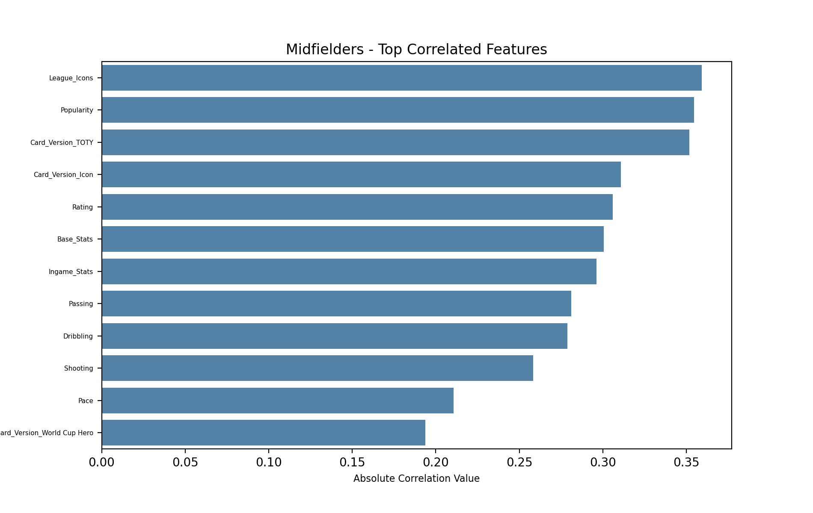
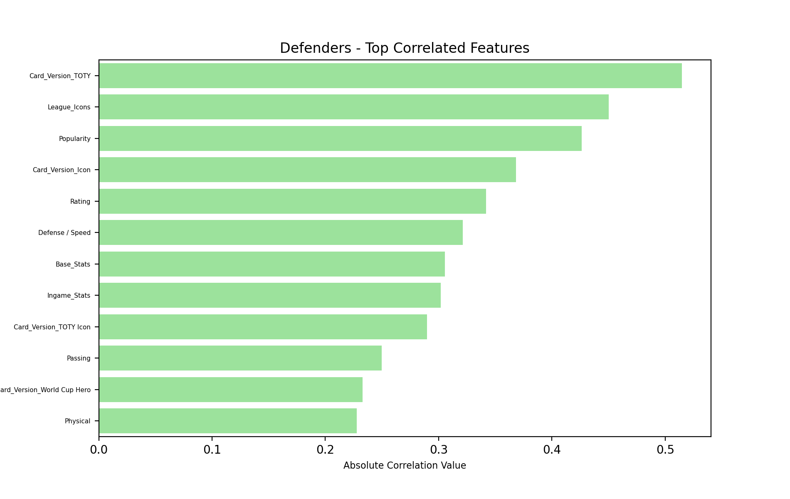
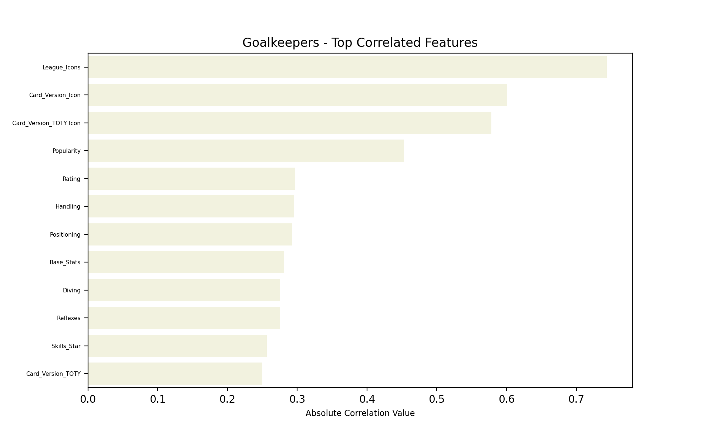

# Predicting-FIFA-23-Ultimate-Team-Player-Market-Prices

# Background

### What is FIFA Ultimate Team?

FIFA Ultimate Team (FUT) is a popular game mode within the FIFA video game franchise that allows players to build their own virtual football team by collecting and trading player cards. Each player card has its own set of attributes and can be used in matches against other players' teams. Player cards in FIFA Ultimate team can be obatined in a variety of ways such as through packs, the transfer market, rewards, and special events. Each method has its own advantages and disadvantages, and the best method may depend on the player's preferences, budget, or playing style. Each player card in the game has an overall rating, face card ratings (PAC, DRI, PAS, DEF, PHY, SHO) as well as in-game stats which are all meant to closely reflect their real life ability in matches. 

# Business Problem

This project will mainly focus on players obtaining player cards through the transfer market price using regression techniques and how player card prices are determined. Naturally we would believe that the higher the rating the higher the market price. However, there are many situations where this is not the case and so the aim of this project is to explore which factors are most important when determing a players market price value and in doing so hope to create a suitable regression machine learning model using FIFA 23 Ultimate data to predict player card prices.

# Obtaining the Data and Data Cleaning

### Where did the data come from?

The dataset was downloaded from Kaggle and the creator was Lucas Silva. The data was scraped from the Futbin website, a famous FIFA Ultimate Team site that contains the database all all Ultimate Team players and features.

Below is an overview of all the features included in the dataset and which will be considered when creating the Machine Learning model:

Name = Name of player

Club = Club that player plays for

Nation = Players nation

League = League that club is in

Rating = Players overall rating 0-99

Main_postion = Positon that is on the face of that players card

Alternate_Positions: the positions that the player can also play

Card_Version: type of the card - Rare Gold, ICON, Common Gold

Run_Style: the way player runs - Explosive, Controlled and Lenghty

Price: the current price of the player on Ultimate Team Market

Price_Variation: the daily price difference

Skills_Star: measures how many skills a player can do - varies from 1 to 5

WeakFoot_Star: measures how well a player execute actions with his weak foot - varies from 1 to 5

Attack_Workrate: measures how is the intensity of the player attacking - High, Medium and Low

Defense_Workrate: measures how is the intensity of the player defending - High, Medium and Low

Pace / Diving: Pace: how fast a player is in game / Diving: how well a goalkeeper jumps to the ball - 0 to 99

Shooting / Handling: Shooting: how well a player shoots in game / Handling: how well a goalkeeper is with his hands - 0 to 99

Passing / Kicking: Passing: how well a player pass in game / Kicking: how well a goalkeeper kicks the ball - 0 to 99

Dribbling / Reflexes: Dribbling: how well a player dribbles in game / Reflexes: how fast a goalkeeper reacts to the ball - 0 to 99

Defense / Speed: Defense: how well a player defends in game / Speed: how fast a goalkeeper is in game- 0 to 99

Physical / Positioning: Physical: how strong a player is in game / Positioning: how well a goalkeeper positionates himself in goal - 0 to 99

Height: in centimeters / in feet

BodyType: how is the player's body in game

Popularity: the balance of likes and dislikes in the Futbin

Base_Stats: the sum of the stats from the front of card

Ingame_Stats: the sum of all stats from the player

### Loading the Data and Importing relevant Libraries

### Dealing with player cards with a price of '0'

When the player card ratings were plotted against their corresponding price it was discovered that there were a large number of player cards with prices of zero. With further investigation it was found that there were 1654 cases were a player card had a price of zero so the decesion was made to drop these players to avoid any biased or misleading results. Here are some potential reasons why some player cards may have a price of zero:

1. Limited availability: Some players may be extremely rare or difficult to obtain for example ICON Ronaldinho , which could make it difficult to establish a market price. If a player is not commonly traded on the transfer market, there may be no recent price data available.

2. Newly released players: Players who have been recently released in a new update or content release may not yet have a market price established. This could be because players have not yet had the opportunity to buy and sell the player on the transfer market.

3. Outdated or inaccurate data: The Ultimate Futbin database relies on user-submitted data, and some of this data may be outdated or inaccurate. This could result in missing or incorrect price information for some players.

### Encoding Categorical Data

Given my prior domain knowledge of the game, I was confident that player card features such as player nation and the league of the player card had an impact on the market price value of a player card. Howvever, features such as player Nation and player League are categorical variables and are not continuous. In order to include our categorical variables in our linear regression model they needed to be converted into numeric variables. This is where encoding comes in. The reason why we need to use encoding for categorical variables in linear regression is that the algorithm cannot handle categorical variables in their raw form. Linear regression assumes that the independent variables are continuous and have a linear relationship with the dependent variable. If categorical variables are not encoded properly, the model may treat them as continuous variables, which can lead to incorrect estimates of the coefficients and invalid statistical inference. So to offset this potential issue one-hot encoding was used on the nessecary categorical features.

The categorical features that were chosen for the model were, Nation, League, Card_Version,	Attack_Workrate and	Defense_Workrate.

Steps:

1. Firstly, I grouped together all the categorical features I wanted to include in my linear regression model into one data frame using .select_dtypes(include='object') method. These were stored in a variable called 'cat_features'

2. Dummy variables for each of the features were created to represent the categorical data in a numerical form. Also known as One-Hot encoding.
This was done using the pandas method .get_dummies() and was stored in the variable 'cat_features_encoded'

3. The continuous features from the original data frame, 'player_cards', were grouped together and stored in a sepearte variable 

4. Lastly, I concatenated the continuous features, encoded categorical features along with the names and main position of the players all into one final data set called 'combined_data_set'.

### Scaling of Data

A Robust Scalar was used to standardise the data. RobustScaler is a data normalization technique that is commonly used in machine learning to transform features by scaling them to a common range. It is robust to the presence of outliers in the data, making it a useful preprocessing step when the dataset contains such outliers. Applying the RobustScaler to the data after one-hot encoding can help to normalize the range of the numerical features and improve the performance of machine learning algorithms.

# Modelling Workflow

My main assumption was that the market price of a player is likely to be determined by different attributes depending on their position. As a result, the data set was split into three possitions: Attackers, Midfielders, Defenders and Goalkeepers

Below is a player count for each position just to visualise the amount of players in the data set:

Below are the visuals for the top correlated features to a player cards market value price, done for each position:

As expected dribbling, shooting and passing were amongst the highest contributing features to a player cards market value price. 

For midfielders, dribbling, passing, shooting and pace were amonsgt the highest contributing features to market value price. This is expected as you would like your midfielders to be very well rounded players. What I mean by this is that you would like them to be comfortable in the attacking third of the field as well as having confidence in them to also create chances as well, which would require good passing attributes. 

For defenders, we could of guessed which features would have been well correlated to a players price. From this plot we can suggest that FIFA players expected good passing, physical, and defending attributes when looking to purchase a player on the market as these attributes were amonsgt the highest features relating to a players market value price. 

What stood out for me with the goalkeepers plot was how highly correlated 'card_version_icon' feature was in relation to a player cards market value price. An ICON is a special type of player card that represents legendary football players from the past. These players are highly sought after by FUT players due to their high ratings, unique skills, and abilities. Its fair to say FUT players would prefer to have ICON player cards in between the sticks for their teams. 

### Summary 
It was no surprise that 'card_version_TOTY' was in the top three highest contributing feature to a player cards price for each position. (TOTY) card is a special card that features some of the highest-rated and most popular players in the game. These cards are released once a year in January and are selected based on their real-world performances from the previous calendar year. The TOTY cards are highly sought after by FUT players because they have some of the best stats in the game and are generally considered to be some of the most valuable and rare items in the game. As a result, any type of TOTY card will already have a high market value price. Overall, the top correlated features were all relatively low meaning that there is a weak or no linear relationship between these features and the 'Price'. With that said I was still eager to see how well different regression models would perfrom in predicting player cards market values prices.

## Model Used

For this project 4 differet regression models were used to predict a player cards market value price, these were: Linear Regression, Lasso Regression, Ridge Regression and Polynomial Regression. All of them had data pre-processed fit using the steps mentioned above. Each of the models were created using the top 12 features for each player card position in relation to market value price. This was done because it would require a lot of time and computational power to create models using each feature in our dataset, also based off my initial domain knowledge of the game I deemed some features in our data as insignificant in determining a player cards market value price. After each of the model had been created and fitted to our training data using default hyperparameters, each of the models performance were evaluated using mean cross_val_scores with ‘neg_root_mean_squared_error’ as the scoring metric. Ideally, we want an RMSE value as close to 0 as possible. 

Here are the results for each of the models:

# Conclusion and Evaluation

Linear, Lasso and Ridge regression models each displayed the same general trend in terms of the error value for each position. 'Attack' positions had the greatest mean squared error value for each of the models and this decreased up until the 'Goalkeeper' position. Overall, a high mean squared error (MSE) indicates that the relationship between the features and the target variable may not be well captured by the linear regression model. This could be due to a variety of reasons, such as nonlinearity in the relationship between the features and the target variable, outliers in the data that are skewing the relationship, or missing important features that are related to the target variable. Another reason I believe is because of underfitting. Underfitting occurs when a model is too simple and fails to capture the underlying patterns in the data, leading to poor predictive performance. 

To improve my price predictions I could try using non-linear regressions models that may be better suited for capturing complex relationships between the features and the target variable or by using a GridSearch to find out the best hyperparaeters for our existing models. 

Its still early days in my Data Science journey but I am happy with the progress I am making and although I did not get result I was looking for with this project I at least know where I could improve and how I will go about it in future projects. 

Thank you for taking the time to read my project. 

